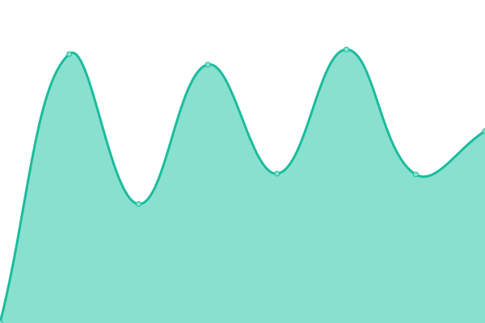
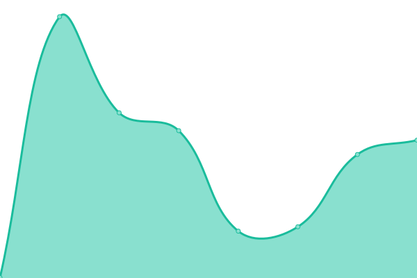

# [📈 Live Status](https://uptime.7ed.net): <!--live status--> **🟩 All systems operational**

This repository contains the open-source uptime monitor and status page for [7ED](https://7ed.net), powered by [Upptime](https://github.com/upptime/upptime).

With [Upptime](https://upptime.js.org), you can get your own unlimited and free uptime monitor and status page, powered entirely by a GitHub repository. We use [Issues](https://github.com/7ednet/uptime/issues) as incident reports, [Actions](https://github.com/7ednet/uptime/actions) as uptime monitors, and [Pages](https://uptime.7ed.net) for the status page.

<!--start: status pages-->
<!-- This summary is generated by Upptime (https://github.com/upptime/upptime) -->
<!-- Do not edit this manually, your changes will be overwritten -->
<!-- prettier-ignore -->
| URL | Status | History | Response Time | Uptime |
| --- | ------ | ------- | ------------- | ------ |
|  [Toots Social](https://toots.social) | 🟩 Up | [toots-social.yml](https://github.com/7ednet/uptime/commits/HEAD/history/toots-social.yml) | 

 1570ms
     
 | 

<a href="https://uptime.7ed.net/history/toots-social">98.92%</a>
    

|  [Toots Social's static things](https://s3.toots.social) | 🟩 Up | [toots-social-s-static-things.yml](https://github.com/7ednet/uptime/commits/HEAD/history/toots-social-s-static-things.yml) | 

 727ms
     
 | 

<a href="https://uptime.7ed.net/history/toots-social-s-static-things">100.00%</a>
    

|  [@im.sb Mastodon](https://mastodon.im.sb) | 🟩 Up | [im-sb-mastodon.yml](https://github.com/7ednet/uptime/commits/HEAD/history/im-sb-mastodon.yml) | 

 1844ms
     
 | 

<a href="https://uptime.7ed.net/history/im-sb-mastodon">100.00%</a>
    

|  [@im.sb Mastodon's static things](https://s3.imsb.app) | 🟩 Up | [im-sb-mastodon-s-static-things.yml](https://github.com/7ednet/uptime/commits/HEAD/history/im-sb-mastodon-s-static-things.yml) | 

 304ms
     
 | 

<a href="https://uptime.7ed.net/history/im-sb-mastodon-s-static-things">100.00%</a>
    

<!--end: status pages-->

[**Visit our status website →**](https://uptime.7ed.net)

## 📄 License

- Powered by: [Upptime](https://github.com/upptime/upptime)
- Code: [MIT](./LICENSE) © [7ED](https://7ed.net)
- Data in the `./history` directory: [Open Database License](https://opendatacommons.org/licenses/odbl/1-0/)
